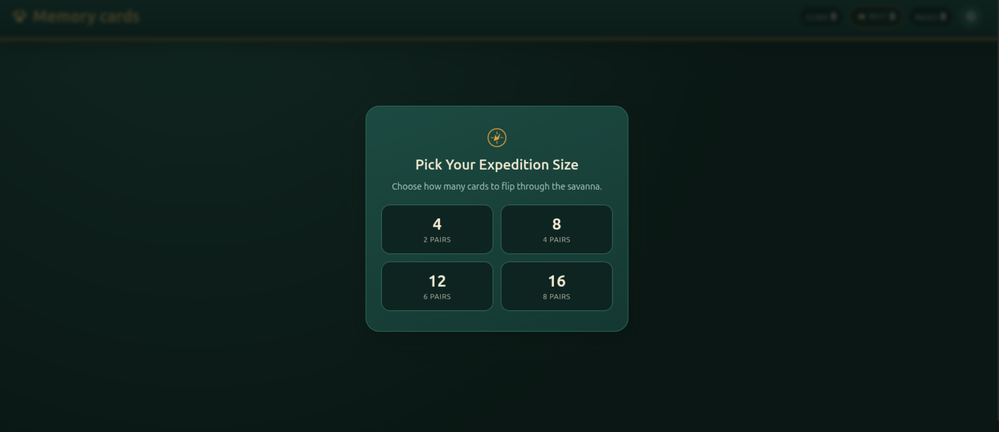
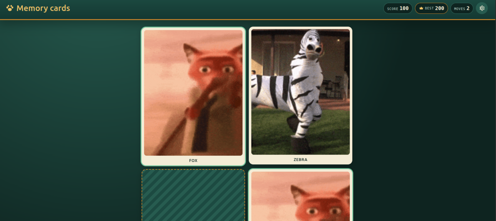

# Memory Cart

Memory Cart is a React and Vite memory-card game. Players choose a board size, flip cards to find matching animal pairs, and try to finish with the highest score.

## Features

- Board size selection with 4, 8, 12, or 16 cards.
- Randomized animal pairs for each new game.
- Score, best score, and move tracking.
- Best score persistence per board size using `localStorage`.
- Animated card reveal and match states.
- Optional animal GIFs from Giphy through `VITE_GIPHY_API_KEY`.
- Fallback card artwork when no Giphy API key or image is available.
- GitHub Pages deployment workflow.

## Tech Stack

- React 19
- Vite 8
- Oxlint
- Plain CSS modules organized by component

## Project Structure

```text
src/
  App.jsx                    Main app shell and modal orchestration
  main.jsx                   React entry point
  index.css                  Global reset and base styles
  theme.css                  Design tokens for color, fonts, shadows, and sizing
  components/
    BoardSizeModal.jsx       Initial board picker and settings modal
    Card.jsx                 Individual memory card UI
    GameBoard.jsx            Responsive card grid and loading state
    Header.jsx               Score, best score, moves, and settings button
    Icons.jsx                Inline SVG icons used by the UI
    WinModal.jsx             End-of-game summary and replay controls
  data/
    animals.js               Animal pool and random animal selection helper
  hooks/
    useGameBoard.js          Core game state, matching rules, scoring, and restart logic
    useLocalStorage.js       Local storage-backed React state helper
  services/
    giphy.js                 Giphy search wrapper with in-memory caching and fallback handling
  styles/
    *.css                    Component-specific styles
```

## How The Code Works

`App.jsx` owns the top-level flow. It stores the selected board size in `localStorage`, opens and closes the settings modal, starts the game after a board size is selected, and shows the win modal when every pair is matched.

`useGameBoard.js` contains the game logic. It picks animals, fetches one GIF per animal, builds a shuffled deck with two cards for each animal, tracks selected cards, counts moves, applies scoring, flips mismatched cards back after a short delay, and saves a new best score when the board is completed.

The scoring rules are simple:

- Matching a pair adds `100` points.
- Missing a pair subtracts `5` points.
- The score never goes below `0`.

`GameBoard.jsx` renders the board grid based on the selected board size. `Card.jsx` renders each card as a button with front and back faces, disables cards that have already been matched, and sends flip actions back to the game hook.

`services/giphy.js` reads `VITE_GIPHY_API_KEY` from Vite environment variables. If the key is missing or the request fails, the game still works and cards use the built-in fallback display.

## Getting Started

Install dependencies:

```bash
npm install
```

Start the development server:

```bash
npm run dev
```

Build for production:

```bash
npm run build
```

Preview the production build locally:

```bash
npm run preview
```

Run linting:

```bash
npm run lint
```

## Environment Variables

Create a local `.env` file if you want live animal GIFs:

```bash
VITE_GIPHY_API_KEY=your_giphy_api_key
```

The app can run without this value. Missing or failed GIF requests fall back to the local card UI.

## Deployment

`vite.config.js` sets:

```js
base: '/memory-cart/'
```

This base path is needed for the GitHub Pages deployment at `/memory-cart/`. The GitHub Actions workflow in `.github/workflows/workflow.yml` installs dependencies, builds the app, uploads the `dist` folder, and deploys it to GitHub Pages on pushes to `main`.

## Screenshots

### Board Size Selection



### Gameplay



## Live Links

- https://engineermrezai.github.io/memory-cart/
- https://memory-cart-iec0afspt-engineermrezais-projects.vercel.app/
